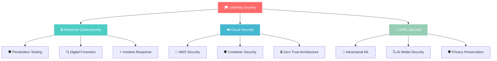

<div align="center">
  
</div>

<div align="center">
  
</div>

<div align="center">
  
</div>

<div align="center">
  
</div>

<div align="center">
  
  
  
</div>

---

## 🎯 Professional Profile

<div align="center">
  <table>
    <tr>
      <td align="center" width="50%">
        
        <h3>🔒 Cybersecurity Specialist</h3>
      </td>
      <td align="center" width="50%">
        
        <h3>💻 Full Stack Developer</h3>
      </td>
    </tr>
  </table>
</div>

```yaml
👨‍💻 Developer Profile:
  name: "Rajesh A"
  location: "India 🇮🇳"
  current_role: "Full Stack Java Developer"
  specialization: ["Cybersecurity", "Ethical Hacking", "Web Security"]
  education: "Computer Science & Cybersecurity"
  experience: "Full Stack Development + Security Research"
  
🎯 Current Focus:
  - Advanced Penetration Testing & Vulnerability Assessment
  - Secure Application Development with Java & Spring Boot
  - React Frontend Development with Security Best Practices
  - Digital Forensics & Incident Response
  
🚀 2024 Goals:
  - Master Advanced Ethical Hacking Techniques
  - Contribute to Open Source Security Projects
  - Build Enterprise-Grade Secure Applications
  - Achieve Professional Security Certifications
```

---

## 🛠️ Technology Arsenal

### 💻 Programming Languages
<div align="center">
  
  
  
  
  
  
  
</div>

### 🚀 Frameworks & Libraries
<div align="center">
  
  
  
  
  
  
  
</div>

### 🗄️ Databases & Cloud
<div align="center">
  
  
  
  
  
  
</div>

### 🔒 Cybersecurity & Ethical Hacking Tools
<div align="center">
  
  
  
  
  
  
  
</div>

### 🛠️ Development Tools & DevOps
<div align="center">
  
  
  
  
  
  
  
</div>

---

## 📊 GitHub Analytics Dashboard

<div align="center">
  
  
</div>

<div align="center">
  
  
</div>

---

## 🏆 Achievement Showcase

<div align="center">
  
</div>

---


## 📈 Skills Proficiency Matrix

<div align="center">
  
| 🎯 **Skill Category** | 🔥 **Proficiency** | 📊 **Experience** | 🚀 **Projects** |
|:---:|:---:|:---:|:---:|
| **Java Development** | ████████████████████ 95% | 3+ Years | 15+ Projects |
| **Cybersecurity** | ████████████████████ 90% | 2+ Years | 10+ Projects |
| **React/Frontend** | ██████████████████ 85% | 2+ Years | 12+ Projects |
| **Python Scripting** | ██████████████████ 85% | 2+ Years | 8+ Projects |
| **Database Design** | ████████████████ 80% | 2+ Years | 10+ Projects |
| **Ethical Hacking** | ████████████████ 80% | 1+ Years | 6+ Projects |
| **DevOps & Cloud** | ██████████████ 75% | 1+ Years | 5+ Projects |

</div>

---

## 🎯 Current Learning Path



---

## 📊 Weekly Coding Activity

<div align="center">
  <h3>⏰ This Week I Spent My Time On</h3>
  
  <table>
    <tr>
      <td align="center" width="25%">
        
        <br><strong>Java</strong>
        <br>🔥 40%
        <br><progress value="40" max="100"></progress>
      </td>
      <td align="center" width="25%">
        
        <br><strong>Python</strong>
        <br>🐍 25%
        <br><progress value="25" max="100"></progress>
      </td>
      <td align="center" width="25%">
        
        <br><strong>React</strong>
        <br>⚛️ 20%
        <br><progress value="20" max="100"></progress>
      </td>
      <td align="center" width="25%">
        
        <br><strong>Security</strong>
        <br>🔒 15%
        <br><progress value="15" max="100"></progress>
      </td>
    </tr>
  </table>
  
  <br>
  
  ```text
  💻 Development Time Breakdown:
  
  Java Spring Boot     ████████████████████████████████████████   40.0%
  Python Scripting     ████████████████████████████████           25.0%
  React Frontend       ████████████████████████                   20.0%
  Security Research    ████████████████                           15.0%
  
  📅 Weekly Stats:
  Total Coding Time: 32 hours
  Most Productive Day: Tuesday (8 hours)
  Primary Focus: Backend Development & Security
  ```
  
  <div align="center">
    
    
    
  </div>
</div>

---

## 🌐 Professional Network

<div align="center">
  <a href="https://www.linkedin.com/in/rajesh-anbu/" target="_blank">
    
  </a>
  <a href="https://github.com/Rajeshanbu" target="_blank">
    
  </a>
  <a href="mailto:rajeshanbu1802@gmail.com" target="_blank">
    
  </a>
  <a href="https://twitter.com/rajesh_anbu" target="_blank">
    
  </a>
  <a href="https://dev.to/rajeshanbu" target="_blank">
    
  </a>
</div>

---

## 💡 Daily Inspiration

<div align="center">
  
</div>

---

## 🐍 Contribution Visualization

<div align="center">
  <picture>
    <source media="(prefers-color-scheme: dark)" srcset="https://raw.githubusercontent.com/platane/platane/output/github-contribution-grid-snake-dark.svg">
    <source media="(prefers-color-scheme: light)" srcset="https://raw.githubusercontent.com/platane/platane/output/github-contribution-grid-snake.svg">
    
  </picture>
</div>

---

## 🎨 Dynamic Footer

<div align="center">
  
  <br>
  <h3>🔥 "Secure Code, Secure Future!" 🔥</h3>
  <p><strong>⭐️ From <a href="https://github.com/Rajeshanbu">Rajesh A</a> | Crafted with ❤️, ☕, and lots of 🔒</strong></p>
  
  
</div>

<div align="center">
  
</div>
```
```


